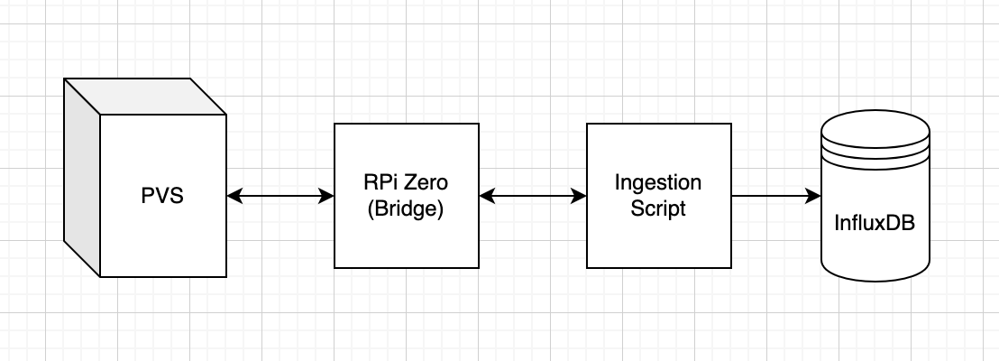

I've had a SunPower system and 14, 400W solar panels installed on my house since May of 2018. It has always frustrated me that SunPower does not allow you to check the production and status of each panel out of the box. The app they give owners access to only displays the total amount of energy generated by the system over a given period of time. For most people this is probably fine and any additional displays would probably confuse the average owner. However, I (and probably you reading this) want to see all the data the system generates because I purchased the system and like hoarding data.

After some googling and reddit rabbit holes, I came across the [sunpower-pvs-exporter](https://github.com/ginoledesma/sunpower-pvs-exporter/blob/master/sunpower_pvs_notes.md) GitHub repo, and Scott Gruby's fantastic [blog post](https://blog.gruby.com/2020/04/28/monitoring-a-sunpower-solar-system/) on how use a Raspberry Pi Zero (WH) as a bridge to call the PVS API.

## System Overview

Identical to [Scott Gruby](https://blog.gruby.com/2020/04/28/monitoring-a-sunpower-solar-system/) setup, I used a RaspberyPi Zero (WH) and an Ethernet Adapter as a network bridge to allow me to call the PVS API from any client on my network. I then wrote a simple python script to ingest data from the PVS to InfluxDB every minute. 

## Lorem ipsum dolor sit amet

Lorem ipsum dolor sit amet, consectetur adipiscing elit. Aliquam vitae justo arcu. Aenean aliquam ligula eu nunc pellentesque, non ullamcorper ex varius. Donec lobortis lorem eget faucibus varius. Duis placerat, turpis et varius gravida, ex quam facilisis orci, at gravida nunc felis vitae velit. Proin a maximus nulla. Fusce quis fermentum quam. Phasellus dictum diam in odio fringilla efficitur. Etiam blandit risus et lacus suscipit euismod. Maecenas metus augue, hendrerit id luctus sit amet, ultricies sit amet risus. Quisque ac magna sem.

## Proin quis lacus neque

Proin quis lacus neque. Mauris lobortis augue sit amet lorem maximus varius. Suspendisse placerat sed felis a ullamcorper. Sed nec mauris id magna scelerisque ultrices. Fusce nec auctor metus. Nullam eu magna hendrerit, lacinia tellus non, imperdiet lorem. Vivamus finibus eros quis accumsan malesuada. Proin vel metus erat. Curabitur pretium sollicitudin elementum. Duis dolor massa, fringilla ut ipsum nec, pellentesque tristique nisl. Vestibulum vitae nunc enim. Fusce dolor eros, gravida nec rhoncus ut, dapibus et massa. In euismod volutpat massa, non accumsan quam tincidunt vel.

### Sed eu volutpat augue

Sed eu volutpat augue, ac aliquet arcu. Donec sollicitudin nisl est, et suscipit ligula consectetur at. Curabitur vitae erat enim. Vivamus posuere at justo ac gravida. Etiam fringilla tortor eros, non varius arcu faucibus eget. Maecenas tincidunt tellus odio, sit amet consequat justo luctus vitae. Integer eget mollis quam. Praesent id ex in turpis tempor aliquam. In semper, ex vel feugiat porta, tellus magna ullamcorper nibh, consectetur vestibulum magna turpis a velit. Nam hendrerit nisl in magna interdum, non luctus urna maximus. Aenean luctus auctor diam, sit amet sagittis risus porta at. Nulla aliquet ante ipsum, ac scelerisque orci ultrices eget. Integer efficitur enim non leo tristique euismod. Donec a dolor non mauris porta pulvinar. Mauris commodo urna nec turpis placerat, non porta leo ullamcorper. Quisque et risus metus.

### Cras aliquet ipsum

Cras aliquet ipsum sit amet eros posuere, ut consectetur massa ultrices. Aliquam tortor enim, fermentum non mauris vel, feugiat aliquet sem. Nam euismod iaculis lacus eget convallis. Sed sollicitudin ultrices eros, sodales vulputate sem cursus a. Phasellus lobortis erat sit amet lacus lobortis malesuada volutpat eget ligula. Sed bibendum scelerisque bibendum. Proin eu tristique elit. Vivamus posuere elit nisl, ac pretium mauris imperdiet quis.

Aenean gravida et sapien quis bibendum. Vivamus vitae rutrum felis, id dictum mauris. Vestibulum auctor eu nulla at scelerisque. Curabitur tellus mi, faucibus sit amet odio vel, commodo venenatis neque. Ut tincidunt magna at metus fringilla eleifend. Donec imperdiet lacinia varius. Integer in justo nec libero cursus ultricies eu at metus. Curabitur vel justo sed erat malesuada feugiat. Sed mattis interdum finibus. Donec non dui consectetur, pharetra purus quis, pellentesque odio.