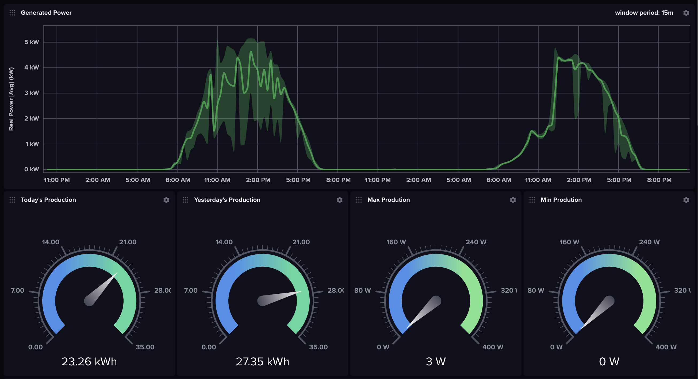
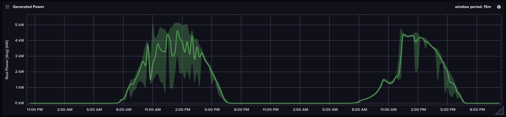
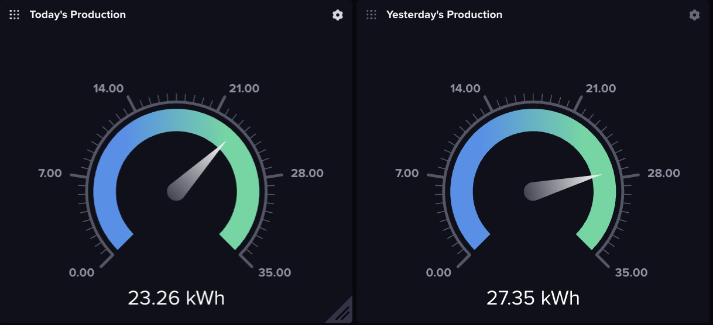
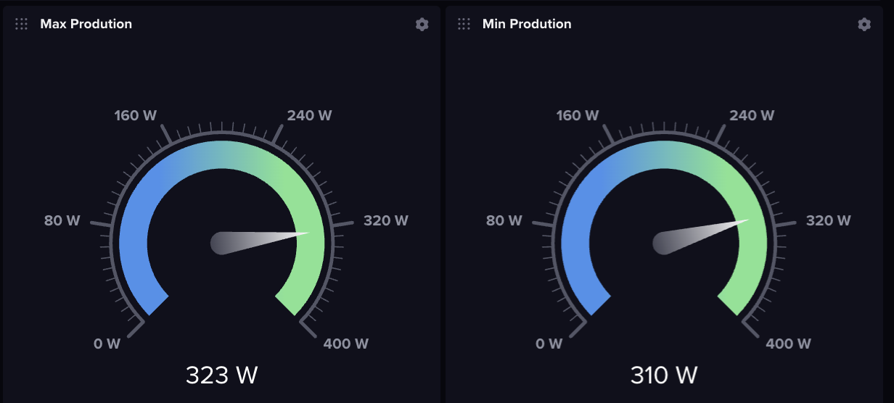
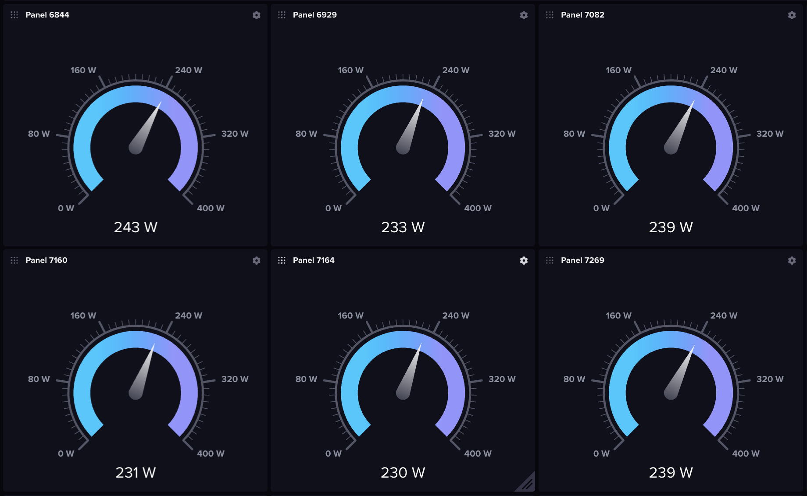

---

title: 'Ingesting Solar Panel Production from a SunPower PVS to InfluxDB'
date: 2024-09-29
draft: false
category: 
  - Home Lab
tag:
  - influxdb
  - rpi
  - solar
  - sunpower
  - ingest
  - project
toc: true
thumbnail: "images/main-featured.svg"
author: Jonathan Logan

---

I've had a SunPower system and 14, 400W solar panels installed on my house since May of 2019. It has always frustrated me that SunPower does not allow you to check the production and status of each panel out of the box. The app they give owners access to only displays the total amount of energy generated by the system over a given period of time. For most people this is probably fine and any additional displays would probably confuse the average owner. However, I (and probably you reading this) want to see all the data the system generates because I purchased the system and like hoarding data. I’m also concerned with SunPower’s recent Bankruptcy filing, I will lose monitoring services through SunPower all together.

After some googling and reddit rabbit holes, I came across the [sunpower-pvs-exporter](https://github.com/ginoledesma/sunpower-pvs-exporter/blob/master/sunpower_pvs_notes.md) GitHub repo, Scott Gruby's fantastic [blog post](https://blog.gruby.com/2020/04/28/monitoring-a-sunpower-solar-system/) on how to use a Raspberry Pi Zero (WH) as a bridge to call the PVS API, and [this PDF](https://starreveld.com/PVS6%20Access%20and%20API.pdf) by Dolf Starreveld which goes into significant detail about monitoring different SunPower products.


## Sunpower and Monitoring Hardward Overview



SunPower System
1. SunPower PVS6
2. 14 SunPower 400W Solar Panels

Monitoring System
1. Raspberry Pi Zero WH
2. [Ethernet/USB HUB HAT Expansion Board for Raspberry Pi](https://a.co/d/2lUA4nP)
3. Raspberry Pi 4B
4. InfluxDB v2 running on a Synology NAS

The [Ethernet/USB HUB HAT Expansion Board for Raspberry Pi](https://a.co/d/2lUA4nP) is installed on the Raspberry Pi Zero WH to add an ethernet port to the RPi Zero. Cheaper options exist, like a mini-USB to Ethernet Adapter, but I had one of these left over from a previous project and used it.

There are a million ways to store the data captured from the PVS6. In my case I chose to use an InfluxDB instance because I wanted to learn the technology. Others have used HomeAssistant as their data store, or a simple text file.

## Data Ingestion System Overview

Identical to [Scott Gruby](https://blog.gruby.com/2020/04/28/monitoring-a-sunpower-solar-system/) and [Dolf Starreveld’s](https://starreveld.com/PVS6%20Access%20and%20API.pdf) setups, I used a RaspberyPi Zero (WH) and an Ethernet Adapter as a network bridge to allow me to call the PVS API from any client on my network. I then wrote a simple python script to ingest data from the PVS every minute to an InfluxDB instance I host locally. 



## Setup Instructions:

Some customers have consumption monitors and storage installed, my system does not. This post will only cover how to ingest Inverter, PSV, and Power Meter data into an InfluxDB instance.

### Setup the Raspberry Pi as a Bridge 

1. Download the [Raspberry Pi Imager](https://www.raspberrypi.org/downloads/)
2. Select the Raspbian Lite image
3. Using the advanced setting:
    - Add your wifi setting
    - Assign a username and password
    - Enable SSH
4. Write the image to an SD card
5. Boot Pi and ensure it connects to your network by finding it on your router’s DCHP table
6. Verify you can connect to the Pi by SSHing into it
7. Assign a static IP address mapping on your router for the Pi
8. Reboot the Pi
9. After the Pi finishes it reboot and reconnects to your networt; Update the OS using \
```sudo apt-get update```
10. Reboot the Pi 
11. Install ha-proxy \
```sudo apt-get install haproxy```
12. Add the following to /etc/haproxy/haproxy.cfg: \
```lighty {linenos=inline}
frontend http
    bind *:80
    default_backend backend_servers

backend backend_servers
    server sv1 172.27.153.1:80

listen stats
    bind *:8080
    stats enable
    stats uri /
    stats refresh 10s
    stats admin if LOCALHOST \
```
13. Shutdown the Pi.
14. Connect the Pi to PVS6 Ethernet Port LAN(1) port via ethernet
15. Connect the Pi to any PVS6 USB to supply power to the Pi Zero
16. Now when you issue HTTP calls to the Pi, they’ll go to the PVS6.


### Setup the InfluxDB Bucket

Create an InfluxDB Bucket called `solarPanelProduction`, and generate an API token you will use to post data to the bucket. Remember to copy the API token to a text file as you can only view it once in InfluxDB.

### Ingest Data to InfluxDB

I'm using a Raspberry Pi 4B running Ubuntu to pull data from the PVS6 (via the RPi Zero Bridge) and write the data to my InfluxDB instance. I wrote the following Python script to grab data from the PVS6 and write the data to my InfluxDB instance. This script is being run every minute via a cron job, and prints are output to a text file. You will need to install `influxdb_client` and modify the script to include your RPi IP Address, InfluxDB URL, and API Token (see the highlighted lines).

```python {linenos=inline}
import influxdb_client, os, time, requests, pprint
from influxdb_client import InfluxDBClient, Point, WritePrecision
from influxdb_client.client.write_api import SYNCHRONOUS

token = "<token>"
org = "<InfluxDB Org>"
bucket="solarPanelProduction"
influxUrl = "<influxDB URL and Port>"
sunpowerUrl = "http://<RPiStaticIP>/cgi-bin/dl_cgi?Command=DeviceList"

r = requests.get(sunpowerUrl)
data = r.json()

#pprint.pprint(data)

measurements = []

for device in data["devices"]:

    pvs = {}
    powerMeter = {}
    inverter = {}

    if device["DEVICE_TYPE"] == "PVS":
    
        pvs["measurement"] = "PV Supervisor"
        pvs["tags"] = {}
        pvs["tags"]["Device Type"] = device["DEVICE_TYPE"]
        pvs["tags"]["Model"] = device["MODEL"]
        pvs["tags"]["Hardware Version"] = device["HWVER"]
        pvs["tags"]["Software Version"] = device["SWVER"]
        pvs["tags"]["Serial Number"] = device["SERIAL"]
        pvs["tags"]["Operational State"] = device["STATE"]
        pvs["fields"] = {}
        pvs["fields"]["Comm Error"] = int(device["dl_comm_err"])
        pvs["fields"]["CPU Load"] = float(device["dl_cpu_load"])
        pvs["fields"]["Uptime"] = int(device["dl_uptime"])
        pvs["fields"]["Error Count"] = int(device["dl_err_count"])
        pvs["fields"]["Untransmitted"] = int(device["dl_untransmitted"])
        measurements.append(pvs.copy())

    if device["DEVICE_TYPE"] == "Power Meter" and device["TYPE"] == "PVS5-METER-P":
        
        powerMeter["measurement"] = "Power Meter"
        powerMeter["tags"] = {}
        powerMeter["tags"]["Device Type"] = device["DEVICE_TYPE"]
        powerMeter["tags"]["Model"] = device["MODEL"]
        powerMeter["tags"]["Serial Number"] = device["SERIAL"]
        powerMeter["tags"]["Operational State"] = device["STATE"]
        powerMeter["tags"]["Type"] = device["TYPE"]
        powerMeter["tags"]["Software Version"] = device["SWVER"]
        powerMeter["fields"] = {}
        powerMeter["fields"]["Frequency (Hz)"] = float(device["freq_hz"])
        powerMeter["fields"]["Total Net Energy (kWh)"] = float(device["net_ltea_3phsum_kwh"])
        powerMeter["fields"]["Real Power [Avg] (kW)"] = float(device["p_3phsum_kw"])
        powerMeter["fields"]["Reactive Power (kVAr)"] = float(device["q_3phsum_kvar"])
        powerMeter["fields"]["Real Power (kVA)"] = float(device["s_3phsum_kva"])
        measurements.append(powerMeter.copy())

    if device["DEVICE_TYPE"] == "Inverter":
        inverter["measurement"] = "Inverter"
        inverter["tags"] = {}
        inverter["tags"]["Device Type"] = device["DEVICE_TYPE"]
        inverter["tags"]["Model"] = device["MODEL"]
        inverter["tags"]["Model Serial Number"] = device["MOD_SN"]
        inverter["tags"]["Serial Number"] = device["SERIAL"]
        inverter["tags"]["Operational State"] = device["STATE"]
        inverter["tags"]["Type"] = device["TYPE"]
        inverter["tags"]["Software Version"] = device["SWVER"]
        inverter["tags"]["Hardware Version"] = device["hw_version"]
        inverter["fields"] = {}
        inverter["fields"]["Frequency (Hz)"] = float(device["freq_hz"])
        inverter["fields"]["AC Current (amps)"] = float(device["i_3phsum_a"])
        inverter["fields"]["DC Current (amps)"] = float(device["i_mppt1_a"])
        inverter["fields"]["Total Energy (kWh)"] = float(device["ltea_3phsum_kwh"])
        inverter["fields"]["AC Power (kW)"] = float(device["p_3phsum_kw"])
        inverter["fields"]["DC Power (kW)"] = float(device["p_mppt1_kw"])
        inverter["fields"]["DC Voltage (V)"] = float(device["v_mppt1_v"])
        inverter["fields"]["AC Voltage (V)"] = float(device["vln_3phavg_v"])
        inverter["fields"]["Heat Sink Temp (C)"] = float(device["t_htsnk_degc"])
        measurements.append(inverter.copy())

pprint.pprint(measurements)

write_client = influxdb_client.InfluxDBClient(url=influxUrl, token=token, org=org)
write_api = write_client.write_api(write_options=SYNCHRONOUS)
write_api.write(bucket=bucket, org=org, record=measurements)

print("Posted")
```

### Visualize the Data in InfluxDB

Assuming everything is working correctly, you should see data begin to populate in your `solarPanelProduction` Bucket. I created an InfluxDB dashboard to visual my production data over time.



#### Generated Power Graph

The Generated Power Graph is a Band type graph that will display the Max, Min, and Avg power generated for a time window over a time range. When the Min and Max deviate from the average that generally means power generation was not consistent across all your panels during a time window, usually due to weather or shadow. If your min is constantly at zero, a panel is not functioning.



InfluxDB Query Script
```sql {linenos=inline}
from(bucket: "solarPanelProduction")
  |> range(start: v.timeRangeStart, stop: v.timeRangeStop)
  |> filter(fn: (r) => r["_measurement"] == "Power Meter")
  |> filter(fn: (r) => r["_field"] == "Real Power [Avg] (kW)")
  |> aggregateWindow(every: 15m, fn: mean, createEmpty: false)
  |> yield(name: "mean")

from(bucket: "solarPanelProduction")
  |> range(start: v.timeRangeStart, stop: v.timeRangeStop)
  |> filter(fn: (r) => r["_measurement"] == "Power Meter")
  |> filter(fn: (r) => r["_field"] == "Real Power [Avg] (kW)")
  |> aggregateWindow(every: 15m, fn: max, createEmpty: false)
  |> yield(name: "max")

from(bucket: "solarPanelProduction")
  |> range(start: v.timeRangeStart, stop: v.timeRangeStop)
  |> filter(fn: (r) => r["_measurement"] == "Power Meter")
  |> filter(fn: (r) => r["_field"] == "Real Power [Avg] (kW)")
  |> aggregateWindow(every: 15m, fn: min, createEmpty: false)
  |> yield(name: "min")
```

#### Yesterday and Today's Production

The Yesterday and Today's Production gages show a sum of how much power the system is generating today and generated yesterday. You will need to update your Timezone information In the query below. Yoy will also need to swap out `today()` for `yesterday()` to get yesterday's data.



InfluxDB Query Script for Today's Production
```sql {linenos=inline}
import "timezone"
option location = timezone.fixed(offset: -8h) 
from(bucket: "solarPanelProduction")
  |> range(start: today())
  |> filter(fn: (r) => r["_measurement"] == "Power Meter")
  |> filter(fn: (r) => r["_field"] == "Total Net Energy (kWh)")
  |> spread()
  |> yield(name: "spread")
```

#### Min and Max Instantaneous Production Gages

These gages will tell you what your best and worst performing panels are currently producing. I used this as a quick way to tell if I'm having an issue. If these values are disconnected more than expected (like 200W max vs 0W min), I know a panel is offline. The query below is for Max production, simply swap out max for min to get the minimum production panel value.



InfluxDB Query Script for Max Single Panel Production
```sql {linenos=inline}
from(bucket: "solarPanelProduction")
  |> range(start: v.timeRangeStart, stop: v.timeRangeStop)
  |> filter(fn: (r) => r["_measurement"] == "Inverter")
  |> filter(fn: (r) => r["_field"] == "DC Power (kW)")
  |> filter(fn: (r) => r["Operational State"] == "working")
  |> map(fn: (r) => ({r with _value: r._value * 1000.0}))
  |> group(columns: ["_field"])
  |> aggregateWindow(every: v.windowPeriod, fn: max, createEmpty: false)
  |> yield(name: "max")
```

#### Panel Specific Instantaneous Production Gages

These gages will tell you what each panel is producing. Setting these gages up is tedious since you have to set each one up individually, but worth the effort to quickly see which panel is offline or under performing. You will need to change the `Serial Number` filter for each gage you need to create.



```sql {linenos=inline}
from(bucket: "solarPanelProduction")
  |> range(start: v.timeRangeStart, stop: v.timeRangeStop)
  |> filter(fn: (r) => r["_measurement"] == "Inverter")
  |> filter(fn: (r) => r["Serial Number"] == "E00121903036844")
  |> filter(fn: (r) => r["_field"] == "DC Power (kW)")
  |> map(fn: (r) => ({ r with _value: r._value * 1000.0 }))
  |> aggregateWindow(every: v.windowPeriod, fn: last, createEmpty: false)
  |> yield(name: "last")
```